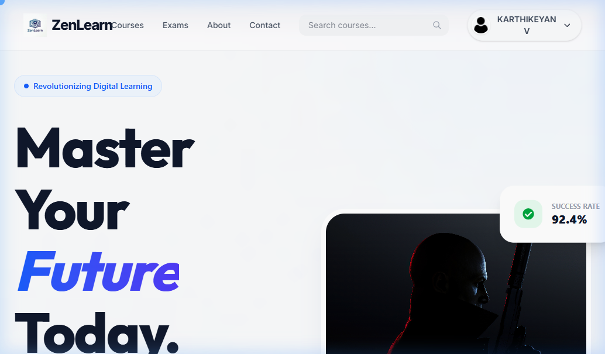
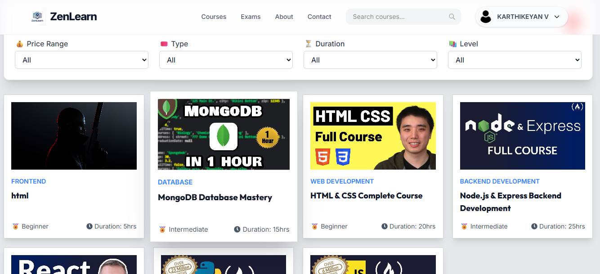
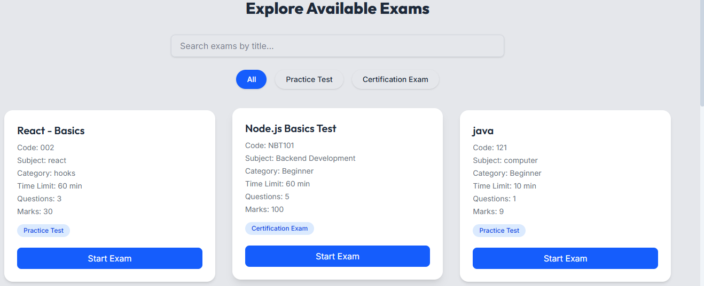
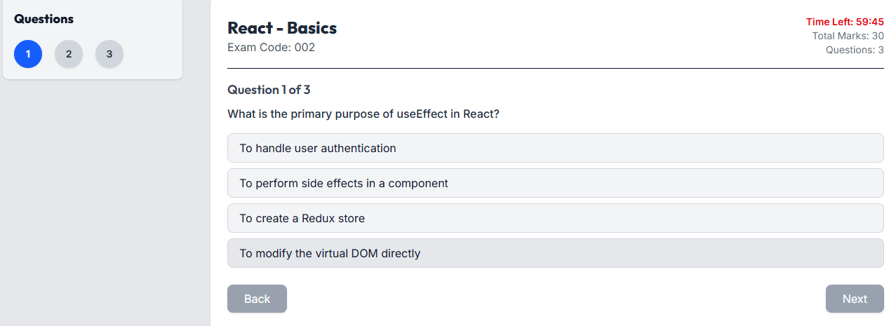

<h1 align="center">🎓 ZenLearn - Learning Management System</h1>

A full-featured Learning Management System (ZenLearn) web application built with the **MERN stack** (MongoDB, Express, React, Node.js). Users can browse, enroll in courses, track their progress, and make payments. Admins can manage courses, users, and track enrollments.

### Preview

Here are some screenshots of ZenLearn:









## Features

- User Authentication (Register/Login)
- Browse and Enroll in Courses
- Course Progress Tracking
- Admin Dashboard for Managing Courses & Users
- Upload Videos, Course Content
- Role-based Access Control

## 🛠️ Tech Stack

### Frontend
- React.js
- Redux Toolkit
- React Router
- Tailwind CSS or Bootstrap

### Backend
- Node.js
- Express.js
- MongoDB (Mongoose)
- JWT for Auth

## 🛠️ Installation

### 1. Clone the Repository

```bash
git clone https://github.com/karthikeyan462-hue/Learning-Management-System.git
cd Learning-Management-System
```

### 2. Install Back-end (Server) Dependencies
```bash
cd back-end
npm install
npm start
```

### 3. Install Front-end (Client) Dependencies
```bash
cd front-end
npm install
npm run dev
```


